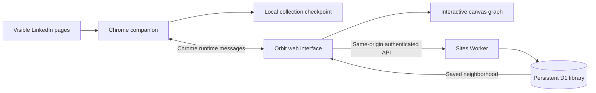

# Orbit — LinkedIn network mapper

Orbit collects visible connection relationships through a local Chrome companion, draws an interactive network, and saves observed people and relationships to a private, persistent library. Collections can overlap: the library merges them so a saved person can be explored without another LinkedIn request.

- **Team repository:** [xXThr0wnshadeXx/Projekt1](https://github.com/xXThr0wnshadeXx/Projekt1)
- **Hosted application:** [Orbit](https://orbit-network-mapper.doublejav.chatgpt.site/)
- **Current application / companion version:** `2.0.0`

The repository is named `Projekt1`; the application is named **Orbit**. The source is public, but the deployed application currently has owner-only access. GitHub access does not grant access to the Site or its database. Ask the project owner for the appropriate development/deployment access.

## Start here

### Prerequisites

- Node.js **22.13 or later** with npm. SQLite tests use the built-in `node:sqlite` module; an older Node release will fail. The application was validated with Node 22.19.
- Python 3 for the build and static preview scripts.
- Git.
- Chrome **120 or later** if you are working on the companion. A LinkedIn session is needed only for live collection, not unit tests or the static UI.
- Authorized access to the existing Sites project for production API/database work and deployment.

### Clone, install, and validate

```sh
git clone https://github.com/xXThr0wnshadeXx/Projekt1.git
cd Projekt1
npm ci
npm run check
npm test
npm run build
npm run preview
```

Open [http://127.0.0.1:8770](http://127.0.0.1:8770). Stop the preview with Ctrl+C. If port 8770 is occupied, stop the old preview process before restarting it.

**The preview is a static Python server, not a local backend.** It serves the UI and supports local Orbit JSON import/export, graph rendering, and directory work. `/api/library/*` is unavailable there. A library connection error in this preview is expected. There is currently no `npm run dev`, local Worker/D1 emulator, or automated GitHub-to-production deployment.

No `.env` file, LinkedIn API key, or database password is required for these local checks. Production receives its `DB` binding and authenticated-user identity from Sites.

### Choose a development path

- **UI and graph:** use the static preview, import a synthetic Orbit JSON file, and edit `index.html`, `styles.css`, `src/app.js`, or `src/graph.js`. Refresh the page after edits; the Python server does not provide hot reload.
- **Collector:** load the repository as an unpacked extension, then use the extension's own page. The local HTTP preview cannot connect to the companion because the external-message allowlist contains only the hosted Orbit origin.
- **Database or API:** start with the SQLite-backed and API unit tests. End-to-end testing requires a separately configured development Site or authorized access to the hosted application. Do not treat the production library as a test database.

## Install and update the Chrome companion

For development, open `chrome://extensions`, enable **Developer mode**, choose **Load unpacked**, and select this repository's root folder—the folder containing `manifest.json`. Click the Orbit extension action to open its own interface. Changes to the background worker or manifest require clicking **Reload** on the extension card; refresh any open Orbit interface afterward.

For a packaged install:

```sh
npm run package
```

Unzip `dist/orbit-network-mapper.zip` and load the extracted `orbit-network-mapper` folder. To update an existing packaged install, pause collection, replace the files in the same unpacked folder, click **Reload**, and refresh Orbit. Avoid uninstalling the extension when you want to preserve its local checkpoint. Export important work first.

For the hosted workflow, open Orbit in the **same Chrome profile** as the installed companion and LinkedIn session, then select **Connect companion**. An in-app browser or another browser profile does not share Chrome's extension installation.

The extension ID is `ocgpgkedpdglaealclnhmgolkfpehafa`. The public `key` in `manifest.json` keeps unpacked installations consistent; it is not a private credential. Keep that key, `COMPANION_ID` in `src/companion.js`, and the expected version in `src/app.js` consistent.

For a different development Site origin, update both `SITE_ORIGIN` in `src/companion.js` and `externally_connectable.matches` in `manifest.json`. A change to only one will not enable the bridge. Preserve narrow, explicit allowed origins.

## How the application works



1. The companion opens a profile or connection list in Chrome. `src/collector.js` reads rendered page content; the hosted server does not crawl LinkedIn.
2. `src/background.js` manages the queue, request spacing, retries, pauses, and a checkpoint in `chrome.storage.local` under `orbitNetwork`.
3. `src/core.js` normalizes profile URLs, deduplicates people and edges, validates connection-list ownership, and records source evidence.
4. `src/app.js` retrieves changed companion state and updates the graph, directory, coverage, and progress display.
5. `src/library.js` saves changed people first, then relationships, in batches of up to 100. The hosted page must remain open for continuous syncing. Failed saves retain pending work and retry.
6. The Worker validates requests and merges records into D1. Library searches read that database without opening LinkedIn.

The browser checkpoint and the permanent library serve different purposes. The checkpoint contains a resumable collection queue; the library contains accumulated people, connections, and observations across runs. Closing the hosted page stops syncing, but the companion can retain progress locally. Reopening the hosted page and connecting can sync that checkpoint later.

**Wait for “Saved to library” before clearing a local collection.** Clearing the browser collection does not delete records already saved to D1. An exported Orbit JSON file is a graph snapshot, not a complete resumable worker checkpoint. CSV is export-only; it cannot currently be imported.

## Repository guide

```text
index.html                 Application structure and controls
styles.css                 Application styling
manifest.json              Chrome MV3 permissions, version, and allowed Site origin
src/
  app.js                   UI state, companion bridge, import/export, progress
  graph.js                 Canvas rendering, layout, animation, selection, zoom
  collector.js             Injected DOM inspection and pagination functions
  background.js            Collection service worker, queue, pacing, recovery
  core.js                  Shared graph model, URL validation, evidence, serialization
  companion.js             Stable companion ID and allowed hosted origin
  library.js               Browser-to-library sync and saved-person search
server/
  worker.js                Worker fetch entry point and embedded static assets
  api.js                   API routing, identity, origin checks, body limits
  database.js              Validation, transactional ingestion, search, traversal
db/schema.ts               Drizzle SQLite schema
drizzle/                   Versioned SQL migrations and Drizzle metadata
drizzle.config.ts          Migration generation configuration
vite.config.js            Worker bundle and Sites metadata plugin
.openai/hosting.json       Existing Site project ID and logical DB binding
tools/package.py           Packages the Chrome companion
tools/build.py             Builds assets, companion download, and Worker artifact
tests/                     Unit tests and isolated synthetic UI fixtures
```

The frontend uses plain JavaScript modules and HTML Canvas; there is no React application or frontend framework. Runtime application code has no third-party library dependency. Vite, the Sites plugin, Drizzle tooling, and LinkeDOM support builds, schema management, and tests.

Generated output is ignored by Git:

- `out/`: assembled static assets and the downloadable companion ZIP.
- `.build/assets.js`: generated asset map consumed by the Worker bundle.
- `dist/server/index.js`: deployable Worker bundle.
- `dist/.openai/`: hosting metadata and staged migrations.
- `node_modules/`: installed development dependencies.

`npm run build` first packages the companion, copies it into `out/downloads/`, and then rebuilds `dist/` with Vite. After a full build, use **`out/downloads/orbit-network-mapper.zip`** for the companion. Run `npm run package` separately when you specifically need the ZIP at `dist/orbit-network-mapper.zip`.

## Graph and database model

Each person is identified by a canonical profile URL such as `https://www.linkedin.com/in/example/`. Relationships are undirected: sorted endpoint IDs form a stable edge ID, so A–B and B–A merge. Every accepted relationship needs a connection-list source URL and observation time. A missing edge means “not recorded,” not proof that two people are unconnected.

The library has three tables:

- **`people`**: primary key `(owner, id)`; name, normalized search name, headline, location, first-seen and last-seen timestamps. A name index supports prefix search.
- **`connections`**: primary key `(owner, a, b)` with sorted endpoints; first-seen and last-seen timestamps. Forward and reverse access paths support adjacency lookup.
- **`evidence`**: primary key `(owner, a, b, source)`; latest observation time for each relationship/source combination.

`owner` is the authenticated Sites user ID. Every read and write is scoped to it. **Giving a teammate Site access does not merge their library with yours.** A shared team graph would require an explicit workspace/authorization design; it is not implemented.

Ingestion validates endpoints before writing, then uses a D1 transaction batch for idempotent upserts. JSON SQL parameters keep bind counts bounded. Existing nonempty profile fields survive empty updates. The current schema does not use foreign keys; preserve endpoint validation when changing ingestion. The `CROSS JOIN` order in JSON ingestion queries is intentional: it avoids a poor SQLite query plan found during testing.

People and connection `first_seen` / `last_seen` values reflect ingestion timing. Evidence `observed_at` reflects the supplied observation time. Neither proves that a relationship still exists today. Deleted LinkedIn relationships are not automatically removed, and URL changes can produce a new person ID.

### Change the schema

```sh
# First edit db/schema.ts, then:
npx drizzle-kit generate
npm test
npm run build
```

Review the generated SQL and commit it together with `drizzle/meta/` and the schema change. Once deployed, migrations are immutable: add a new migration instead of rewriting one already applied. Sites stages/applies migrations during deployment. Never create or alter production tables in an API request handler.

## Library API

Routes live under `/api/library/` on the hosted Site. They are intended for the signed-in application, not anonymous public access. The trusted Sites dispatcher supplies `oai-authenticated-user-id`; do not replace this with a client-supplied user ID. A standalone server must establish a trusted authentication boundary before reusing this handler.

- **`GET /stats`** returns `{ people, connections, lastSaved }` for the current user.
- **`GET /search?q=...`** accepts a name prefix or full profile URL and returns `{ people: [...] }`, with at most 30 results. This is not fuzzy or full-text search.
- **`GET /graph?url=...&depth=2&limit=1000`** returns `{ found, root, nodes, edges, truncated, depth, limit }` for a saved person. A missing person returns `found: false` and empty node/edge arrays. Supported depth is 1–2 and node limit is 10–3,000. The UI requests 1,000 nodes.
- **`POST /ingest`** accepts JSON `{ nodes: [...], edges: [...] }` and returns `{ saved: true }`. Send at most 100 nodes and 100 edges per request, with a body no larger than 500,000 bytes. A node needs a valid `id` or `url`; an edge needs `source`, `target`, and 1–20 evidence records containing a supported list `url` and parseable `observedAt`. Save endpoints before edges, or include them in the same batch.

POST requests require `Content-Type: application/json` and an `Origin` matching the request origin. API responses are not cached. Missing identity returns 401; an invalid POST origin returns 403; oversized bodies return 413; unsupported content types return 415; validation failures return 400. Unknown routes return 404, and an absent DB binding returns 503.

The neighborhood traversal bounds both node count and database work. `truncated: true` means a sample is being shown, not a complete neighborhood. The graph response includes one recent evidence record per displayed edge; the database can retain several source records. UI exports of that view therefore do not back up the entire permanent library.

## Collection behavior and limits

- One active collection tab; at least **120 seconds between collector-initiated navigation, pagination, and load-more actions**. The UI also offers 5- and 10-minute intervals. DOM polling is separate from page-action spacing, and LinkedIn may make its own background requests.
- The next allowed action time is persisted. Older multi-tab queues are migrated to one lane; browser restart pauses collection for an explicit resume.
- Collection depth is 1–3 and is fixed for a run. The per-run cap is 10–10,000 people. Raising the cap and resuming can extend a capped run.
- Sign-in, verification, and restriction notices pause collection. Transient failures retry at most twice before a branch is marked incomplete.
- A changed connection owner is not accepted. Equivalent filter encodings are normalized; viewer-degree filter changes with the same owner are recorded as adjusted coverage.
- Hidden lists, mutual-only lists, missing pagination, and repeated page cycles remain visible in Coverage. A completed queue does not mean every real connection was discovered.

There is no application-imposed 10,000-person lifetime limit on the library, but D1 has storage and execution limits. Million-node throughput and long live crawls have **not** been validated. The current graph is a bounded view of stored observations, not a prepopulated global LinkedIn directory. There is no unattended server crawler, shared team library, automated freshness sweep, full-library export, or record-deletion interface yet.

LinkedIn prohibits third-party automated scraping. Slower timings do not establish permission or guarantee that an account will avoid restrictions. Preserve the stop behavior; do not add verification bypasses, credential extraction, or hidden-data inference. See [LinkedIn's prohibited software guidance](https://www.linkedin.com/help/linkedin/answer/a1341387).

## Tests and validation

```sh
npm run check                         # JavaScript syntax checks
npm test                              # Full Node test suite
node --test tests/database.test.js     # Persistence and traversal only
node --test tests/background.test.js   # Collection scheduling and recovery only
npm run build                         # Production artifact and companion
```

The imported 2.0.0 baseline passes 41 tests. Coverage includes URL/graph invariants, DOM extraction, mocked Chrome scheduling and migration, graph behavior, API identity/origin/body checks, SQLite account isolation, repeat ingestion, source evidence, and bounded neighborhoods. SQLite tests use an in-memory database initialized from committed migrations; no production data is needed. Synthetic tests do not establish actual LinkedIn collection speed or end-to-end production reliability.

`tests/ui-fixture.html` and `tests/ui-fixture.js` provide an isolated synthetic rendering fixture. `tests/make-ui-fixture.js` can generate a 1,501-person Orbit JSON sample, but its output path is currently hard-coded to `/private/tmp/orbit-ui-test.network.json` for macOS. Adapt that path on another OS. Keep synthetic datasets in local tests; importing them into the hosted app will persist them in that account's library.

Before a PR, run the checks relevant to the change and the production build. Include what changed, how it was checked, and any migration or companion-update requirement. For DOM fixes, add a sanitized minimal fixture reproducing the failure instead of committing personal profile HTML.

## Troubleshooting

### Companion is disconnected

Use Chrome with the installed extension in the same browser profile, reload the extension, refresh the hosted page, and connect again. Check the extension ID and both origin allowlists if using a development deployment. The local preview is not on the external-message allowlist.

### Library says it is unavailable or not yet saved

The Python preview has no library API. On the hosted Site, verify that you are signed in and that your account has access. Check the browser Network panel for `/api/library/*` responses. A 503 points to a missing `DB` binding; a 400 can indicate invalid imported evidence or missing endpoints. Keep the page open for retry, and do not clear the checkpoint until saving succeeds. Never share session cookies or auth headers in a bug report.

### Pages increase but the people count stays still

Inspect the last-page counters: **new people**, **new links**, and **already mapped**. Reading overlapping lists can add relationships without new people. Check Coverage for repeated pages, mutual-only results, or incomplete branches. For a reproducible report include the companion version, sanitized progress message, selected depth/cap, and whether new-link counts change.

### Collection is waiting or paused

“Next LinkedIn request” is the deliberate pacing timer. A pause has a separate reason in the status area; use **View tab** to inspect the affected page. Resolve sign-in or account restrictions before resuming. If the person cap was reached, raise it first. A hidden list cannot be made complete by retrying indefinitely.

### Tests or builds fail on a teammate's machine

Check `node --version` and `python3 --version`, then rerun `npm ci` from the repository root. Missing `node:sqlite` generally indicates an old Node release. Run `npm run build`, not bare `vite build`: the Python build generates `.build/assets.js` before Vite bundles the Worker. Inspect the failing test/build output before changing dependencies or the lockfile.

## Deployment and team workflow

Work on a feature branch and open a PR to GitHub `main`:

```sh
git switch main
git pull --ff-only
git switch -c your-feature-name
# Make changes and run the relevant validation.
git add <changed-files>
git commit -m "Describe the resulting behavior"
git push -u origin your-feature-name
```

There are currently **no GitHub Actions workflows**. A GitHub push saves source but does not publish Orbit. The existing Sites deployment uses a separate Sites-managed source repository. `.openai/hosting.json` points to the existing production Site; do not create a duplicate Site or replace that project ID during ordinary maintenance.

An authorized release maintainer should:

1. Review the current Site audience and use the existing project. GitHub's public visibility does not imply that the hosted application should be public.
2. Bring the reviewed GitHub changes into the Sites source checkout and run `npm ci`, `npm run check`, `npm test`, and `npm run build` there.
3. Push that exact source to the Sites-managed repository using a short-lived credential kept out of files and Git config. After the push succeeds, record the full `git rev-parse --verify HEAD` result.
4. Use the Sites hosting workflow to package the built Worker and `.openai` metadata/migrations, then save a Site version against that exact pushed commit. Do not archive the entire source tree or `node_modules`.
5. Deploy the saved version to the intended existing audience, wait for a successful deployment, and verify the database binding and companion download. The build's metadata plugin stages migrations for Sites to apply.
6. For companion changes, keep `manifest.json`, `package.json`, `VERSION` in `src/background.js`, and the expected version in `src/app.js` aligned. Tell users to reload their unpacked companion; publishing the hosted app does not update installed extensions.

Application rollback and database rollback are separate concerns. Check migration compatibility before redeploying older code. There is no project-managed automated backup or full-library restore workflow yet; establish one before treating the database as the sole copy of an important corpus.

Keep credentials, browser profiles, personal datasets, and database dumps out of commits. The current ignore rules cover dependencies, generated output, `*.network.json`, CSV, and ZIP files, but they do **not** ignore every possible secret filename or generic JSON export. Review staged changes before pushing to this public repository. No license file is currently included; public visibility alone should not be taken as an explicit reuse license.

## Further references

- [Cloudflare D1 limits](https://developers.cloudflare.com/d1/platform/limits/)
- [LinkedIn connection API documentation](https://learn.microsoft.com/en-us/linkedin/shared/integrations/people/connections-api)
- [LinkedIn prohibited software guidance](https://www.linkedin.com/help/linkedin/answer/a1341387)
